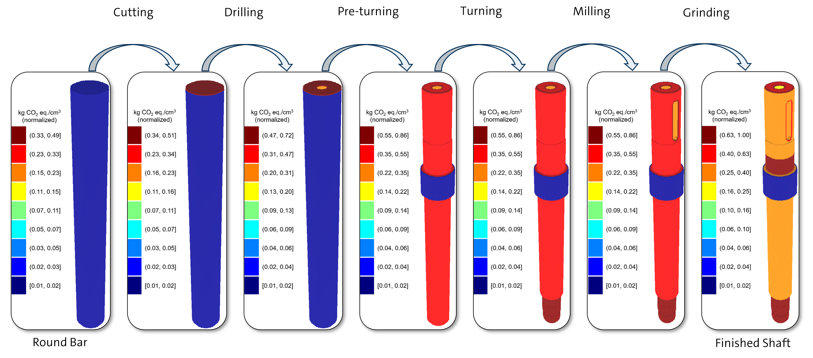

# Introduction

## Goal
The goal of this study is to evaluate the effectiveness of three-dimensional (3D) feature-level Life Cycle Assessment (LCA) visualizations as a tool for sustainable product design decision and sense-making.

## Visualization description

Similar to a Finite Element Analysis (FEA) visualization, the 3D LCA visualization maps the environmental impact of manufacturing a given design to the product geometry and its features. The visualization highlights regions of  

## Study description

The study is a task-based survey which aims to gauge the use of 3D LCA visualizations in representative decision-making scenarios occurring during the product design process. 

You will be given three tasks that are based on typical designer needs when integrating LCA results into the design process.

During each task, all necessary data required to make an informed decision will be available. This includes, LCA results, CAD models and drawings, stress simulation results, in addition to the 3D LCA visualization.

You may use whatever data you want to complete the task, but note that not **all** data is necessarily for every task.

After each task, a short survey will ask how useful was the 3D LCA visualization for acomplishing the given task (if at all).

## Study instructions
Please complete the survey on a desktop computer or laptop, as it contains iteractive 3D model applications which will not be properly displayed on small screens (e.g., mobiles and tablets).

You can take as much time as you need to complete the survey, but, if possible, complete it in one sitting as progress may not be saved. The survey should take approximately [ADD TIME HERE].